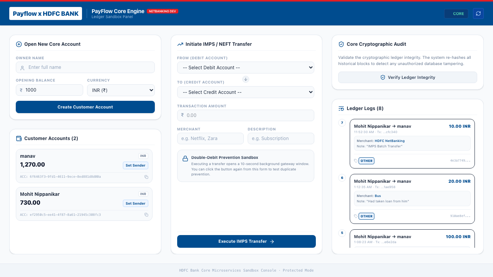

# PayFlow: Enterprise Transaction Processing & Audit Sandbox

[](https://github.com/meet244/PayFlow/actions/workflows/ci.yml)

PayFlow is a high-performance transaction processing and cryptographic audit ledger system. Built as a distributed microservices system, it moves money between accounts using synchronous funds validation, publishes asynchronous event-driven audit logs over Apache Kafka, and hashes ledger entries into a cryptographic chain. 

A modern HDFC-themed React portal serves as a cockpit to interact with the backend services, monitor transactions, and run cryptographic ledger validation checks.

---

## 🛠️ Technology Stack
*   **Backend Services**: Java 21 · Spring Boot 3.4 · Spring Data JPA · PostgreSQL 16 · Redis 7
*   **Message Broker**: Apache Kafka 3.9 (KRaft mode)
*   **Frontend Application**: React 18 · TypeScript · Vite · Tailwind CSS v4 · Lucide Icons
*   **AI Integration**: Google Gemini API (with deterministic fallback rules)
*   **Orchestration & DevOps**: Docker Compose · GitHub Actions

---

## 🏛️ System Architecture

```
                          [ PayFlow x HDFC Bank Web Portal ]
                                  (Port 5173 / React)
                                      |         |
                          +-----------+         +-----------+
              (REST API)  |                         |  (REST API)
                          v                         v
               [ accounts-service ] <====== [ transactions-service ]
                 (Port 8081 / DB)   (REST)    (Port 8082 / DB)
                                                    |
                                                    | (Asynchronous Event)
                                                    v
    [ ledger-service ] <======================== [ Kafka ]
     (Port 8083 / DB)        (Consumer)         (Port 9092)
```

### 1. Synchronous vs. Asynchronous Hops
*   **Transactions ➔ Accounts (Synchronous REST)**: Moving money requires immediate consistency. The debit must check balance sufficiency and lock the row synchronously. If this hop fails, the request is immediately rejected.
*   **Transactions ➔ Ledger (Asynchronous Kafka)**: The ledger acts as an immutable audit trail. It must never block the critical payment flow. If the ledger service is offline, Kafka buffers the `transaction.completed` events; when the ledger service recovers, it catches up automatically with zero data loss.

### 2. Deterministic Idempotency Key (Approach 2)
To protect the system from double-charging (e.g. if the user double-clicks the transfer button or a network retry is fired), the frontend generates a deterministic SHA-256 hash from the transaction payload:
$$\text{Key} = \text{SHA-256}(\text{Debit Acc} + \text{Credit Acc} + \text{Amount} + \text{Merchant} + \text{Description} + \text{1-Minute Window Bucket})$$
If the user clicks transfer again within the same minute with identical details, the calculated key is identical. The backend database blocks the duplicate request using a `unique` column constraint, returning the original transaction without moving funds twice.

### 3. Cryptographic Ledger Chain
The ledger service secures all transactions in a blockchain-style append-only chain. Each ledger entry contains a cryptographic hash of its contents combined with the hash of the previous ledger block. Any modification, deletion, or reordering of historical records breaks the chain, which can be instantly verified.

### 4. Cache-Eviction Reads
To ensure high read performance, Redis caches account balances and ledger listings. To guarantee consistency, writes immediately trigger cache eviction: credits/debits drop the account cache, and new ledger entries evict the ledger list cache.

---

## 📂 Repository Structure

```
payflow/
├── README.md                   # Detailed repository documentation
├── docker-compose.yml          # Infrastructure: Postgres, Kafka, Kafka-UI, Redis
├── docker-compose.apps.yml     # Java Application microservice containers
├── init-db.sql                 # Automated database initialization script
├── .github/workflows/ci.yml    # GitHub Actions Continuous Integration pipeline
├── accounts-service/           # Spring Boot balance management service
├── transactions-service/       # Spring Boot transaction orchestrator
├── ledger-service/             # Spring Boot audit ledger & AI categorizer
└── frontend/                   # React + TypeScript + Tailwind v4 Web Portal
```

---

## 🔌 Service Port Registry

| Service | Port | Database / Broker | Responsibility |
|:---|:---|:---|:---|
| **accounts-service** | `8081` | `accounts_db` (Postgres) | Owns balances; credit/debit operations with optimistic locking (`@Version`). |
| **transactions-service** | `8082` | `transactions_db` (Postgres) | Orchestrates transfers (sync debit/credit), saves status, publishes to Kafka. |
| **ledger-service** | `8083` | `ledger_db` (Postgres) | Consumes Kafka events, appends cryptographic hashes, categorizes via Gemini. |
| **frontend-service** | `5173` | — | Single-page HDFC Bank-themed NetBanking cockpit. |
| **kafka** | `9092` | KRaft Broker | Event broker topic: `transactions`. |
| **kafka-ui** | `8080` | — | Topic UI dashboard: [http://localhost:8080](http://localhost:8080). |
| **redis** | `6379` | — | Cache layer for account lookups and ledger queries. |

---

## 🚀 Running the Sandbox

### Step 1: Start Databases & Services (Docker Compose)
From the root directory, start the full backend infrastructure and applications:
```bash
docker compose -f docker-compose.yml -f docker-compose.apps.yml up --build -d
```
*(Wipe databases and start fresh at any time by running `docker compose -f docker-compose.yml -f docker-compose.apps.yml down -v`)*

### Step 2: Start the Web Portal (Vite + React)
Navigate to the `frontend` directory, install packages, and boot the Vite server:
```bash
cd frontend
npm install
npm run dev
```

Open your browser and navigate to **[http://localhost:5173](http://localhost:5173)**.

---

## 💻 Portal Interface Features



### 🏦 HDFC Bank NetBanking Theme
*   Fully styled in accordance with HDFC Bank's brand identity: Corporate Blue (`#004C8F`) and Crimson Red (`#E31E24`).
*   **Single-Page Layout**: Locked to `100vh` height with no window scrollbar. Accounts and ledger blocks scroll independently inside their respective panels.
*   **Corner Toast Notifications**: Smooth floating slides overlaying success/error alerts without pushing or shifting the grid.

### ⚡ Double-Debit Sandbox Monitor
*   Executing a transfer launches a **10-second processing window** card in the bottom-left corner.
*   While the gateway is active, you can click "Execute IMPS Transfer" again from the main form to submit a duplicate.
*   The log list will immediately capture the duplicate retry request, showing how the deterministic hash key triggered the backend database's `IDEMPOTENT_BLOCK` safeguard to protect account balances.
